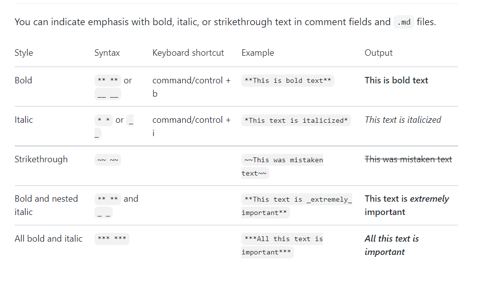

# what is# What is Markdown?
###### Markdown is a lightweight markup language that you can use to add formatting elements to plaintext text documentsMarkdown is a way to style text on the web. You control the display of the document; formatting words as **bold** or *italic*, adding images, and creating lists are just a few of the things we can do with Markdown. Mostly, Markdown is just regular text with a few non-alphabetic characters thrown in

# Styling text

