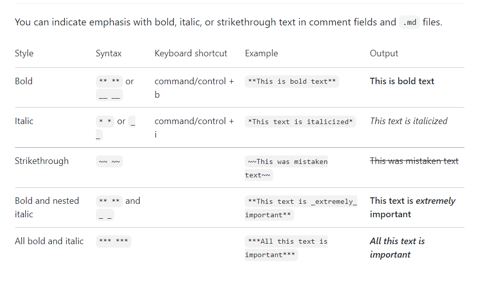
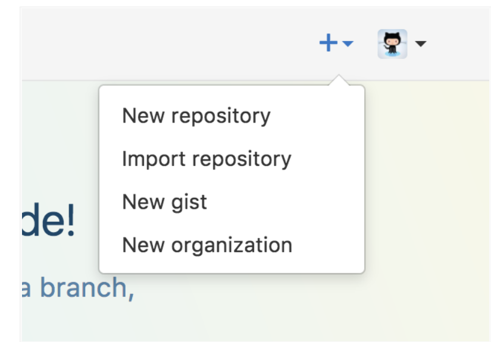
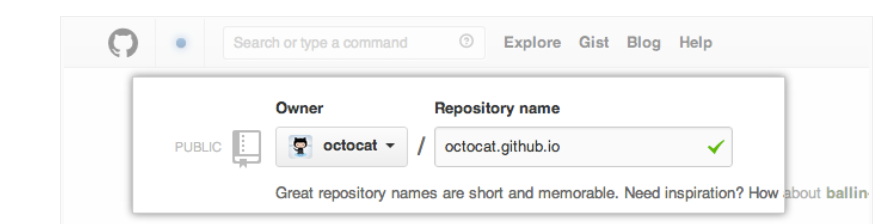

# what  is Markdown?
###### Markdown is a lightweight markup language that you can use to add formatting elements to plaintext text documentsMarkdown is a way to style text on the web. You control the display of the document; formatting words as **bold** or *italic*, adding images, and creating lists are just a few of the things we can do with Markdown. Mostly, Markdown is just regular text with a few non-alphabetic characters thrown in

# Styling text

# Quoting code
## to make qoute `git status`

# Links
## This site is [google](https://www.google.com/).

## what is github?
###### Github is a web-based platform used for version control. Git simplifies the process of working with other people and makes it easy to collaborate on projects. Team members can work on files and easily merge their changes in with the master branch of the projec all work will be online and saves on cloud and GitHub, Inc. is a provider of Internet hosting for software development and version control using Git. It offers the distributed version control and source code management functionality of Git, plus its own features

# Create Your Website
## Once you’ve signed in, you’ll create a new repository to get started.

## On the new repository screen, you need to give this repository a special name to generate your website.

