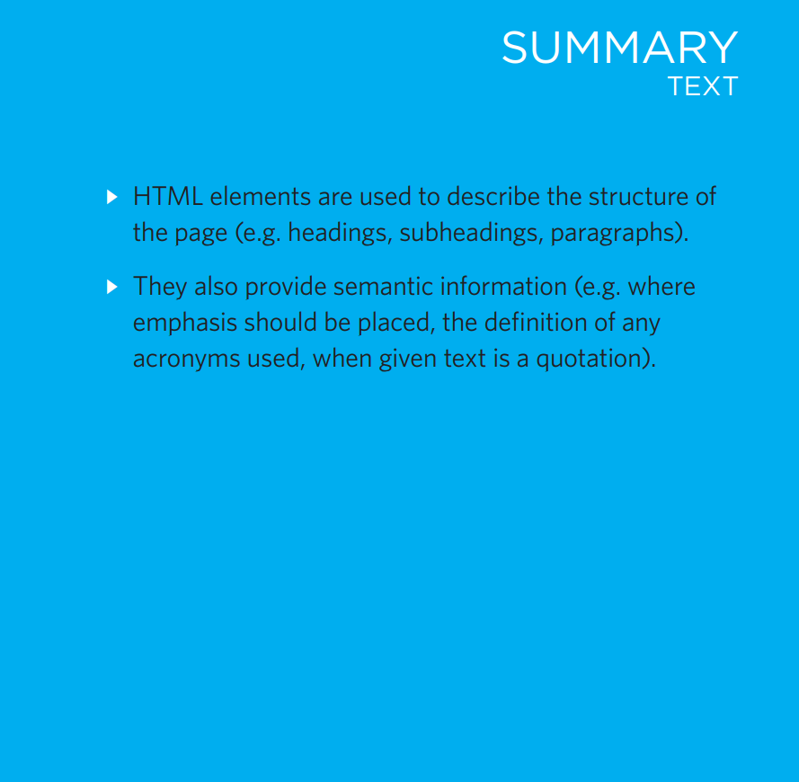
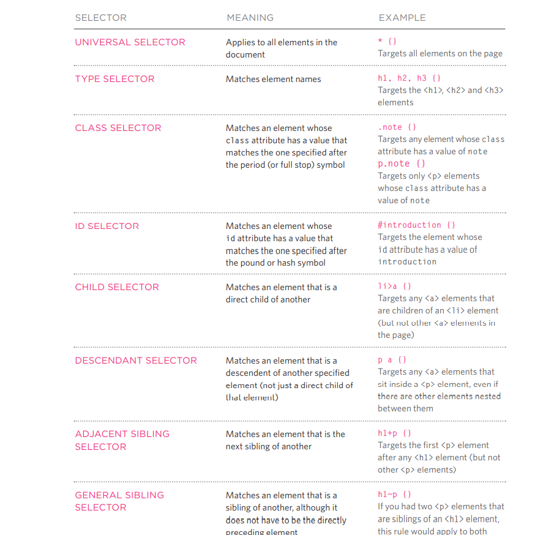
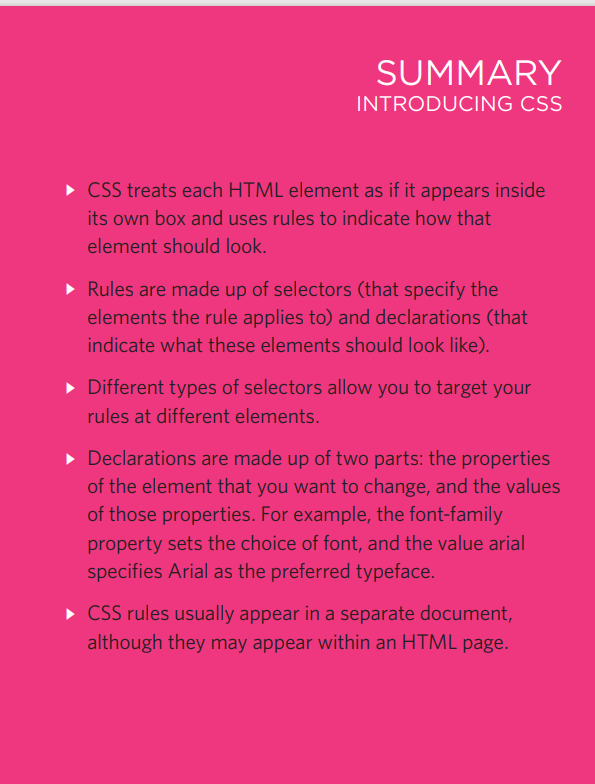
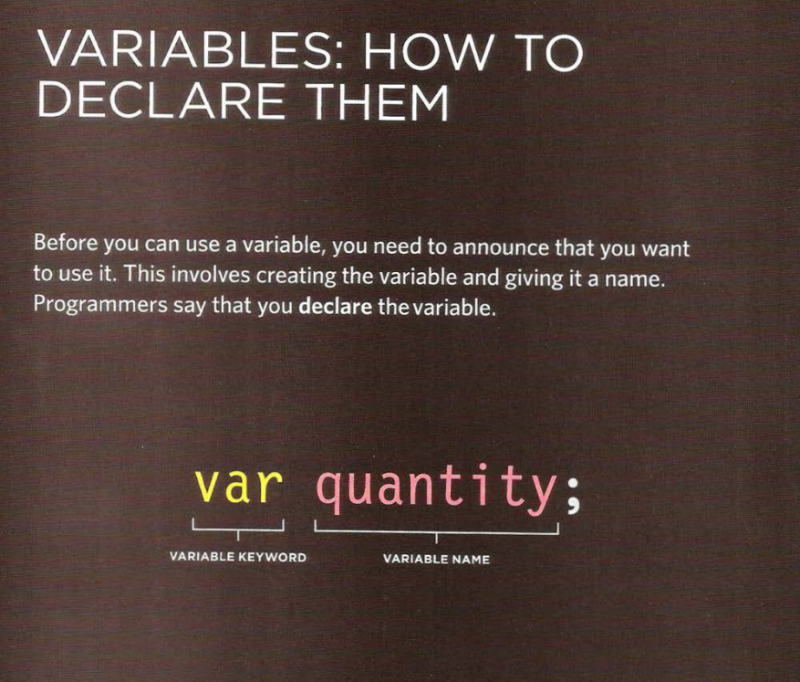
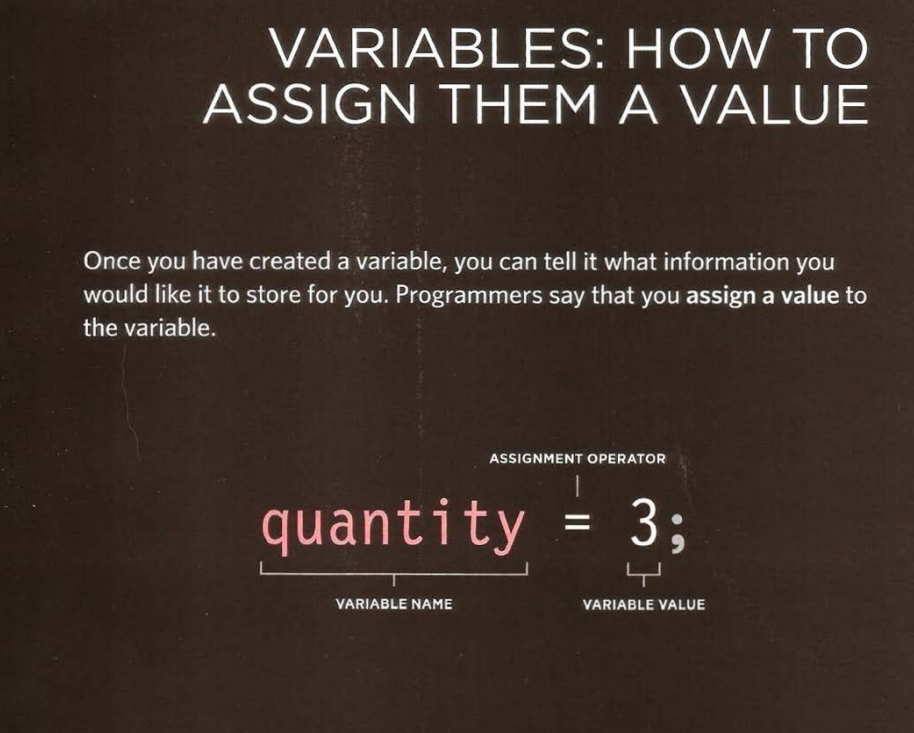
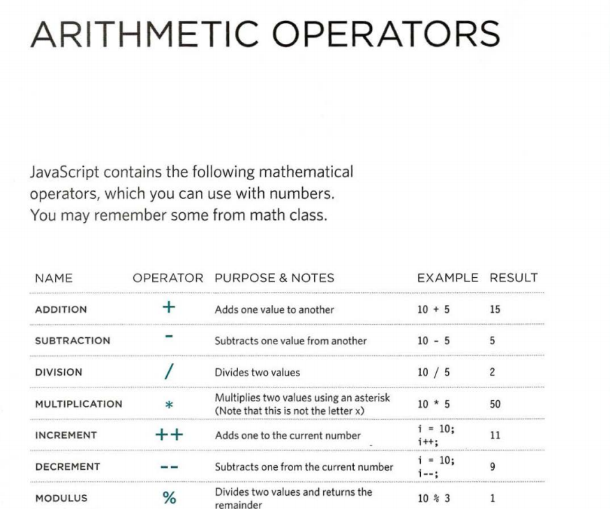

# Headings
'<h1>
<h2>
<h3>
<h4>
<h5>
<h6>

## HTML has six "levels" of 

### headings:
<h1> is used for main headings
<h2> is used for subheadings
If there are further sections 
under the subheadings then the 
<h3> element is used, and so 
on...
Browsers display the contents of 
headings at different sizes. The 
contents of an <h1> element is 
the largest, and the contents of 
an <h6> element is the smallest. 
The exact size at which each 
browser shows the headings 
can vary slightly. Users can also 
adjust the size of text in their 
browser. You will see how to 
control the size of text, its color, 
and the fonts used when we 
come to look at CSS.

<h1>This is a Main Heading</h1>
<h2>This is a Level 2 Heading</h2>
<h3>This is a Level 3 Heading</h3>
<h4>This is a Level 4 Heading</h4>
<h5>This is a Level 5 Heading</h5>
<h6>This is a Level 6 Heading</h6>

# Paragraphs
## To create a paragraph, surround 
the words that make up the 
paragraph with an opening 

tag and closing 
 tag.
By default, a browser will show 
each paragraph on a new line 
with some space between it and 
any subsequent paragraphs.

p>Text is easier to understand when it is split up 
 into units of text. For example, a book may have 
 chapters. Chapters can have subheadings. Under 
 each heading there will be one or more 
 paragraphs.

 # Bold & Italic
 <b>
By enclosing words in the tags 
<b> and </b> we can make 
characters appear bold.
The <b> element also represents 
a section of text that would be 
presented in a visually different 
way (for example key words in a 
paragraph) although the use of 
the <b> element does not imply 
any additional meaning.

<tr>

<i>
By enclosing words in the tags 
<i> and </i> we can make 
characters appear italic.
The <i> element also represents 
a section of text that would be 
said in a different way from 
surrounding content — such as 
technical terms, names of ships, 
foreign words, thoughts, or other 
terms that would usually be 
italicized

# Changes to Content
## 
<ins>
<!-- <del>
The <ins> element can be used 
to show content that has been 
inserted into a document, while 
the <del> element can show text 
that has been deleted from it.
The content of a <ins> element 
is usually underlined, while the 
content of a <del> element 
usually has a line through it" 
 -->

## 
Laptop computer:

<s>Was $995</s>

Now only $375
, 
<h2> and <h3> elements 
should be shown in the Arial 
typeface, in a yellow color.
Properties indicate the aspects 
of the element you want to 
change. For example, color, font, 
width, height and border.
Values specify the settings 
you want to use for the chosen 
properties. For example, if you 
want to specify a color property 
then the value is the color you 
want the text in these elements 
to be

# Using External CSS

The <link> element can be used 
in an HTML document to tell the 
browser where to find the CSS 
file used to style the page. It is an 
empty element (meaning it does 
not need a closing tag), and it 
lives inside the <head> element. 
It should use three attributes:
href
This specifies the path to the 
CSS file (which is often placed in 
a folder called css or styles).
type
This attribute specifies the type 
of document being linked to. The 
value should be text/css.
rel
This specifies the relationship 
between the HTML page and 
the file it is linked to. The value 
should be stylesheet when 
linking to a CSS file.
An HTML page can use more 
than one CSS style sheet. To 
do this it could have a <link>
element for every CSS file it 
uses. For example, some authors 
use one CSS file to control the 
presentation (such as fonts and 
colors) and a second to control 
the layout.

# Using Internal CSS
<!-- <style>
You can also include CSS rules 
within an HTML page by placing 
them inside a <style> element, 
which usually sits inside the 
<head> element of the page. 
The <style> element should use 
the type attribute to indicate 
that the styles are specified in 
CSS. The value should be text/
css.
When building a site with more 
than one page, you should use 
an external CSS style sheet. This:
● Allows all pages to use the 
same style rules (rather than 
repeating them in each page).
● Keeps the content separate 
from how the page looks.
● Means you can change the 
styles used across all pages 
by altering just one file 
(rather than each individual 
page) -->

# CSS Selectors

There are many different types 
of CSS selector that allow you to 
target rules to specific elements 
in an HTML document. 
The table on the opposite page 
introduces the most commonly 
used CSS selectors.
On this page, there is an HTML 
file to demonstrate which 
elements these CSS selectors 
would apply to.
CSS selectors are case sensitive, 
so they must match element 
names and attribute values 
exactly.
There are some more advanced 
selectors which allow you 
to select elements based on 
attributes and their values, 
which you will see on page 292. 
IE 7 was the first version of IE to 
support the last two selectors in 
the table (the sibling selectors), 
so their use is less common than 
the other selectors shown her

# Inheritance
If you specify the font-family
or color properties on the 
<body> element, they will apply 
to most child elements. This is 
because the value of the 
font-family property is 
inherited by child elements. It 
saves you from having to apply 
these properties to as many 
elements (and results in simpler 
style sheets).
You can compare this with 
the background-color or 
border properties; they are not 
inherited by child elements. If 
these were inherited by all child 
elements then the page could 
look quite messy.
You can force a lot of properties 
to inherit values from their 
parent elements by using 
inherit for the value of the 
properties. In this example, the 

 element with a class
called page inherits the padding 
size from the CSS rule that 
applies to the <body> element.

# summary

# javascript part:

## STATEMENTS
A script is a series of instructions that a computer can follow one-by-one. 
Each individual instruction or step is known as a statement. 
Statements should end with a semicolon. 
We will look at what the code on the right does 
shortly, but for the moment note that: 
• Each of the lines of code in green is a statement. 
• The pink curly braces indicate the start and end 
of a code block. (Each code block could contain 
many more statements.) 
• The code in purple determines which code 
should run (as you will see on p149). 
JAVASCRIPT IS CASE SENSITIVE 
JavaScript is case sensitive so hourNow means 
something different to HourNow or HOURNOW. 
STATEMENTS ARE INSTRUCTIONS AND 
EACH ONE STARTS ON A NEW LINE 
A statement is an individual instruction that the 
computer should follow. Each one should start on a 
new line and end with a semicolon. This makes your 
code easier to read and follow. 
The semicolon also tells the JavaScript interpreter 
when a step is over, indicating that it should move 
to the next step. 
@ BASIC JAVASCRIPT INSTRUCTIONS 
var today= new Date{); 
var hourNow = today.getHours{) ; 
var greeting; 
if (hourNow > 18) { 
greeting= 'Good evening'; 
else if (hourNow > 12) { 
greeting= 'Good afternoon'; 
else if (hourNow > O) { 
greeting 'Good morning'; 
else { 
greeting 'Welcome'; 
document.write(greeting) ;

## comment:
You should write comments to explain what your code does. 
They help make your code easier to read and understand. 
This can help you and others who read your code. 
I* Th i s script displays a greeting to the user based upon the current time. 
It is an example from JavaScript & jQuer y book *I 
var today= new Date(); 
var hour Now = today.getHours(); 
var greeting; 
// Create a ne1~ dat e object 
II Fi nd the current hour 
JI Display the appropriate greeti ng based on the current time 
if (hourNow > 18) { 
greet ing = 'Good evening ' ; 
else if (hourNow > 12) { 
greeting = 'Good afternoon'; 
else if (hourNow > 0) { 
greeting= ' Good morning'; 
else { 
gr eeting = 'Welcome'; 
} 
document.write(greeting) ;

## WHAT IS A VARIABLE?
A script will have to temporarily 
store the bits of information it 
needs to do its job. It can store this 
data in variables. 
When you write JavaScript, you have to tell the 
interpreter every individual step that you want it to 
perform. This sometimes involves more detail than 
you might expect. 
Think about calculating the area of a wall; in math 
the area of a rectangle is obtained by multiplying two 
numbers: 
width x height = area 
You may be able to do calculations like this in 
your head, bu t when writing a script to do this 
calculation, you need to give the computer very 
detailed instructions. You might tell it to perform the 
following four steps in order: 
1. Remember the value for width 
2. Remember the value for height 
3. Multiply width by height to get the area 
4. Return the result to the user 
In this case, you would use variables to "remember" 
the values for width and height. (This also illustrates 
how a scrip( contains very explicit instructions about 
exactly what you want the computer to do.) 
You can compare variables to short-term memory, 
because once you leave the page, the browser will 
forget any information it holds. 
A variable is a good name for this 
concept because the data stored 
in a variable can change (or vary) 
each time a script runs. 
No matter what the dimensions of any individual 
wall are, you know that you can find its area by 
multiplying the width of that wall by its height. 
Similarly, scripts often need to achieve the same 
goal even when they are run with different data, so 
variables can be used to represent values in your 
scripts that are likely to change. The result is said to 
be calculated or computed using the data stored in 
the variables. 
The use of variables to represent numbers or other 
kinds of data is very similar to the concept of algebra 
(where le.tters are used to represent numbers). 
There is one key difference, however. The equals 
sign does something very different in programming 
(as you will see on the next two pages). 

## DATA TYPES 
### NUMERIC DATA TYPE 

The numeric data type handles 
numbers. 
0.75 
For tasks that involve counting 
or calculating sums, you will 
use numbers 0-9. For example, 
five thousand, two hundred and 
seventy-two would be written 
5272 (note there is no comma 
between the thousands and 
the hundreds). You can also 
have negative numbers (such 
as -23678) and decimals (three 
quarters is written as 0.75). 
Numbers are not only used for 
things like calculators; they 
are also used for tasks such 
as determining the size of the 
screen, moving the position of 
an element on a page, or setting 
the amount of time an element 
should take to fade in.

### STRING DATA TYPE 
The strings data type consists of 
letters and other characters. 
'H. 
1 ' Ivy! 1 
Note how the string data type is 
enclosed within a pair of quotes. 
These can be single or double 
quotes, but the opening quote 
must match the closing quote. 
Strings can be used when 
working with any kind of text. 
They are frequently used to add 
new content into a page and they 
can contain HTML markup. 

### BOOLEAN DATA TYPE 

Boolean data types can have one 
of two values: true or false. 
true 
It might seem a little abstract at 
first, but the Boolean data type is 
actually very helpful. 
You can think of it a little like a 
light switch - it is either on or off. 
As you will see in Chapter 4, 
Booleans are helpful when 
determining which part of a 
script should run.

## ARITHMETI C OPERATORS 

