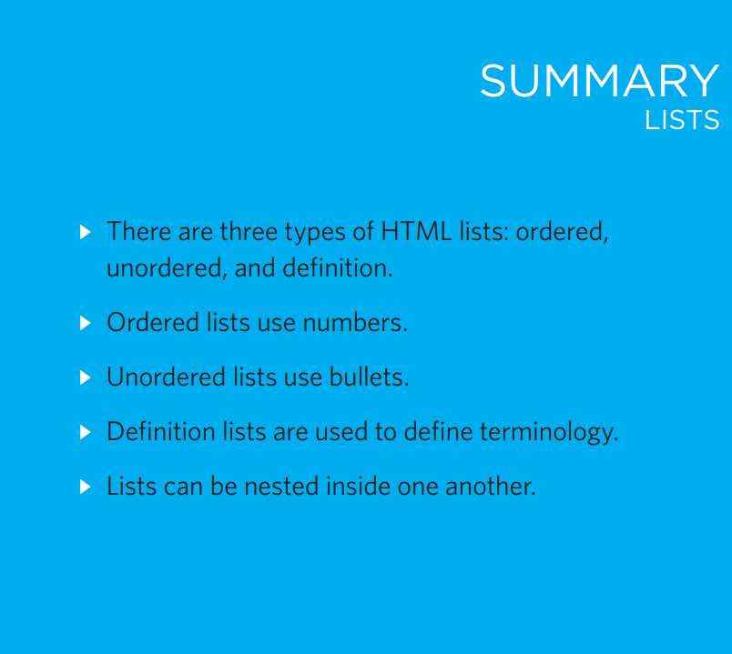
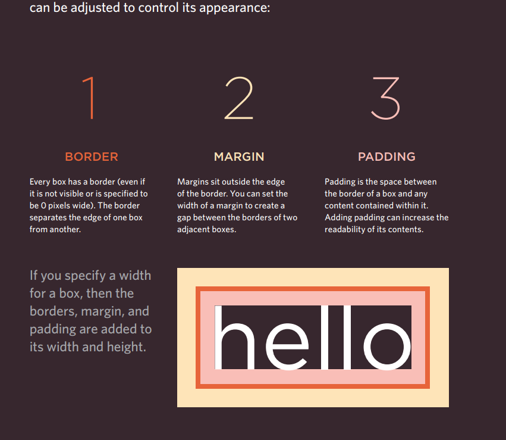
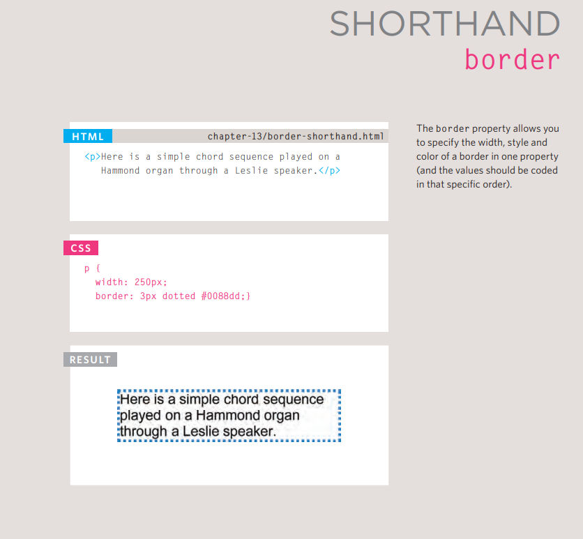

# Ordered Lists
The ordered list is created with 
the  element.

## "li"
    Each item in the list is placed 
    between an opening "li" tag 
    and a closing "li>" tag. (The li
    stands for list item.)
    Browsers indent lists by default.
    Sometimes you may see a type
    attribute used with the "<ol"
    element to specify the type of 
    numbering (numbers, letters, 
    roman numerals and so on). It 
    is better to use the CSS liststyle-type property covered 

# Unordered Lists
## "ul>"
    The unordered list is created 
    with the <ul> element.Each item in the list is placed between an opening <li> tag and a closing </li> tag. (The li
    stands for list item.Browsers indent lists by default Sometimes you may see a 
    type attribute used with the <ul>
    element
    to specify the type of bullet point (circles, squares,diamonds and so on). It is better to use the CSS 

# Definition Lists
## "dl>"
    The definition list is created with 
    the <dl> element and usually 
    consists of a series of terms and 
    their definitions.
    Inside the <dl> element you will 
    usually see pairs of <dt> and 
    <dd> elements.
## <dt>
        This is used to contain the term 
        being defined (the definition 
        term).
## "<dd"    
        This is used to contain the 
        definition.
        Sometimes you might see a list 
        where there are two terms used 
        for the same definition or two 
        different definitions for the same

# summary

# Box Dimensions
## Box Dimensions
    By default a box is sized just big 
    enough to hold its contents. To 
    set your own dimensions for a 
    box you can use the height and 
    width properties.
    The most popular ways to 
    specify the size of a box are 
    to use pixels, percentages, or 
    ems. Traditionally, pixels have 
    been the most popular method 
    because they allow designers to 
    accurately control their size.
    When you use percentages, 
    the size of the box is relative to 
    the size of the browser window 
    or, if the box is encased within 
    another box, it is a percentage of 
    the size of the containing box.
    When you use ems, the size 
    of the box is based on the size 
    of text within it. Designers 
    have recently started to use 
    percentages and ems more for 
    measurements as they try to 
    create designs that are flexible 
    across devices which have 
    different-sized screens.
    In the example on the right, you 
    can see that a containing 

    element is used which is 300 
    pixels wide by 300 pixels high. 
    Inside of this is a paragraph 
    that is 75% of the width and 
    height of the containing element. 
    This means that the size of the 
    paragraph is 225 pixels wide by 
    225 pixels high

   # Limiting Width
## min-width, max-width
Some page designs expand and 
shrink to fit the size of the user's 
screen. In such designs, the 
min-width property specifies 
the smallest size a box can be 
displayed at when the browser 
window is narrow, and the 
max-width property indicates 
the maximum width a box can 
stretch to when the browser 
window is wide  hese are very helpful properties 
to ensure that the content of 
pages are legible (especially on 
the smaller screens of handheld 
devices). For example, you can 
use the max-width property to 
ensure that lines of text do not 
appear too wide within a big 
browser window and you can 
use the min-width property 
to make sure that they do not 
appear too narrow You may find it helpful to try this 
example out in your browser so 
that you can see what happens 
when you increase or decrease 
the size of the browser window  

# Limiting Height
## min-height, max-height
In the same way that you might 
want to limit the width of a box 
on a page, you may also want 
to limit the height of it. This is 
achieved using the min-height
and max-height properties   The example on this page 
demonstrates these properties 
in action. It also shows you what 
happens when the content of the 
box takes up more space than 
the size specified for the box  f the box is not big enough to 
hold the content, and the content 
expands outside the box it can 
look very messy. To control 
what happens when there is not 
enough space for the content of 
a box, you can use the overflow
property, which is discussed on 
the next page

# Border Width
    he border-width property 
    is used to control the width 
    of a border. The value of this 
    property can either be given 
    in pixels or using one of the 
    following values:
    thin
    medium
    thick
    (You cannot use percentages 
    with this property.)
    You can control the individual 
    size of borders using four 
    separate properties:
    border-top-width
    border-right-width
    border-bottom-width
    border-left-width
    You can also specify different 
    widths for the four border values 
    in one property, like so:
    border-width: 2px 1px 1px 
    2px;
    The values here appear in 
    clockwise order: top, right, 
    bottom, lefttt.

# Shorthand order

# ARRAYS 
     An array is a special type of variable. It doesn't 
    just store one value; it stores a list of values.
    You should consider using an 
    array whenever you are working 
    with a list or a set of values that 
    are related to each other. Arrays are especially helpful 
    when you do not know how 
    many items a list will contain 
    because, when you create the 
    array, you do not need to specify 
    how many values it will hold. f you don't know how many 
    items a list will contain, rather 
    than creating enough variables 
    for a long list (when you might 
    only use a small percentage 
    of them), using an array is 
    considered a better solution. For example, an array can be 
    suited to storing the individual 
    items on a shopping list because 
    it is a list of related items. 
    Additionally, each time you write 
    a new shopping list, the number 
    of items on it may differ As you will see on the next page, 
    values in an array are separated 
    by commas. 

# CREATING AN ARRAY 

        "var colors 
    new Array('white ' , 
    'black', 
    'custom'); 
    var el = document.getElementByid( ' colors' ); 
    el.innerHTML = colors.item(O); "

        "var colors; 
    colors ['white', 'black', ' custom']; 
    var el document.getElementByld('col ors'); 
    el . textContent = col ors[O]; 
        "
        
    
# ACCESSING & CHANGING VALUES IN AN ARRAY
## The first lines of code on the left 
    create an array containing a list 
    of three colors. (The values can 
    be added on the same line or on 
    separate lines as shown here.) 
    Having created the array, the 
    third item on the list is changed 
    from 'custom' to 'beige'. 
    To access a value from an array, 
    after the array name you specify 
    the index number for that value 
    inside square brackets. 
    You can change the value of an 
    item an array by selecting it and 
    assigning it a new value just as 
    you would any other variable 
    (using the equals sign and the 
    new value for that item). 
    In the last two statements, the 
    newly updated third item in the 
    array is added to the page.

# II Create the array 
    "var colors = ['white', 
    'black' , 
    'custom']; 
    c02/ js/ update-array.js 
    II Update the third item in the array 
    colors[2] = 'beige ' ; 
    II Get the element with an id of col ors 
    var el = document .getElementByid(' colors') ; 
    II Replace with third item from the array 
    el .textContent = colors[2]; "

     
