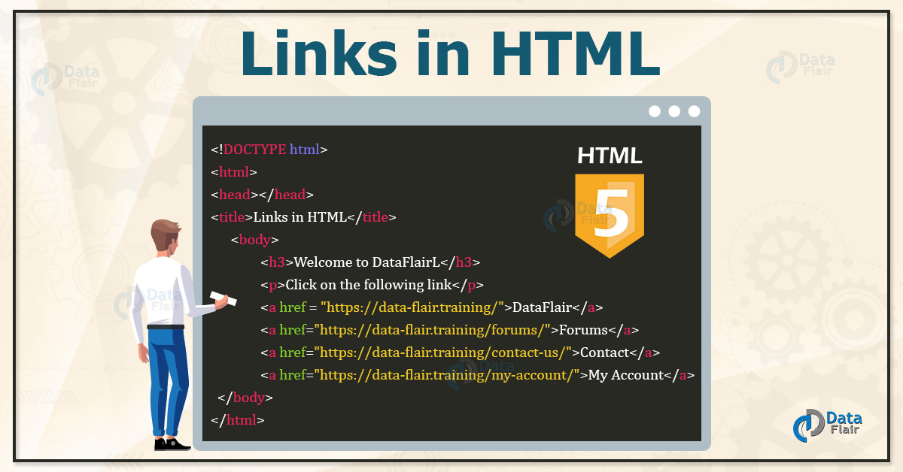
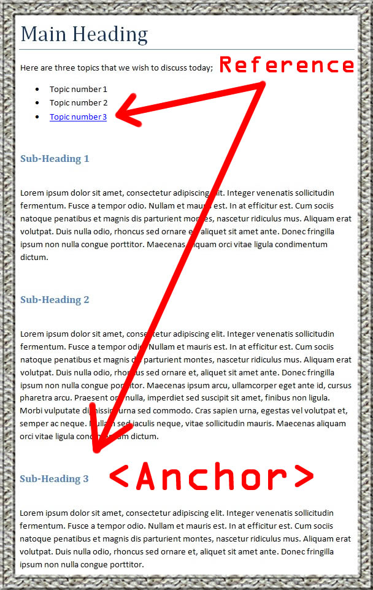
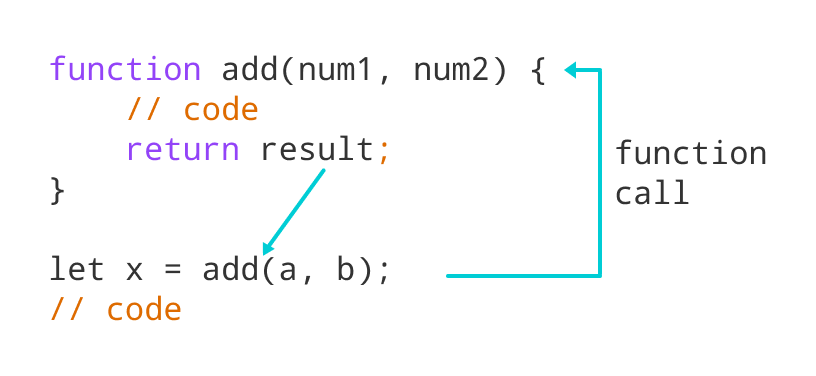

# Duckett HTML&CSS
## links
    Links are the defining feature of the web because they allow you to move from one web page to another — enabling the very idea of browsing or surfing

    Links are created using the element. Users can click on anything between the opening tag and the closing tag. You specify which page you want to link to using the href attribute.

# Linking to a Specific Part of the Same Page

    At the top of a long page you might want to add a list of contents that links to the corresponding sections lower down. Or you might want to add a link from part way down the page back to the top of it to save users from having to scroll back to the top.

# Summary Links
    Links are created using the element.
    The element uses the href attribute to indicate the page you are linking to.
    If you are linking to a page within your own site, it is best to use relative links rather than qualified URLs.
    You can create links to open email programs with an email address in the “to” field.
    You can use the id attribute to target elements within a page that can be linked to

# Layout

# Summary Layout
    1- elements are often used as containing elements to group together sections of a page.
    2- Browsers display pages in normal flow unless you specify relative, absolute, or fixed positioning.
    3- The float property moves content to the left or right of the page and can be used to create multi-column layouts. (Floated items require a defined width.)
    4- Pages can be fixed width or liquid (stretchy) layouts.
    5- Designers keep pages within 960-1000 pixels wide, and indicate what the site is about within the top 600 pixels (to demonstrate its relevance without scrolling).
    6- Grids help create professional and flexible designs.
    7- CSS Frameworks provide rules for common tasks.
    8- You can include multiple CSS files in one page

#  JavaScript
## Functions , Methods & Objects WHAT IS A FUNCTION?

    Functions let you group a series of statements together to perform a specific task. If different parts of a script repeat the same task, you can reuse the function (rather than repeating the same set of statements).

# Reasons for Pair Programming
## Iterative loops. Code reviews. Fast feedback. Error checking and linting. These are software engineering practices that have proven to dramatically improve the quality of code developers produce. What if you can could get all of this, instantaneously, while typing code line by line and character by character? You can, with pair programming, a technique common to many agile work environments. More “two heads are better than one” than “stop reading over my shoulder,” pair programming is the practice of two developers sharing a single workstation to interactively tackle a coding task together. At Code Fellows, pair programing is one way we foster a collaborative environment while developing key industry skills.

# How does pair programming work?
    While there are many different styles, pair programming commonly involves two roles: the Driver and the Navigator. The Driver is the programmer who is typing and the only one whose hands are on the keyboard. Handling the “mechanics” of coding, the Driver manages the text editor, switching files, version control, and—of course writing—code.

# Why pair program?
## Greater efficiency
### it is a common misconception that pair programming takes a lot longer and is less efficient. In reality, when two people focus on the same code base, it is easier to catch mistakes in the making. Research indicates that pair programing takes slightly longer, but produces higher-quality code that doesn’t require later effort in troubleshooting and debugging (let alone exposing users to a broken product)

# Engaged collaboration
    When two programmers focus on the same code, the experience is more engaging and both programmers are more focused than if they were working alone. It is harder to procrastinate or get off track when someone else is relying on you to complete the work. Popping open your Facebook timeline is just that less enticing when someone else is looking at your screen.

# Learning from fellow students
    Everyone has a different approach to problem solving; working with a teammate can expose developers to techniques they otherwise would not have thought of. If one developer has a unique approach to a specific problem, pair programming exposes the other developer to a new solution.

# Social skills
    Pair programming is great for improving social skills. When working with someone who has a different coding style, communication is key. This can become more difficult when two programmers have different personalities. Pair programming not only improves programming skills, but can also help programmers develop their interpersonal skills. When just grabbing the keyboard and taking over isn’t an option, getting good at finding the right words is a skill unto itself.

# Job interview readiness
    A common step in many interview processes involves pair programming between a current employee and an applicant, either in person or through a shared screen. They will carry out exercises together, such as code challenges, building a project or feature, or debugging an existing code base. By doing so, companies can get a better feel for how an applicant will fit into the team and their collaboration style.

## 1- Work environment readiness
    Many companies that utilize pair programing expect to train fresh hires from CS-degree programs on how they operate to actually deliver a product. Code Fellows graduates who are already familiar with how pairing works can hit the ground running at a new job, with one less hurdle to overcome.