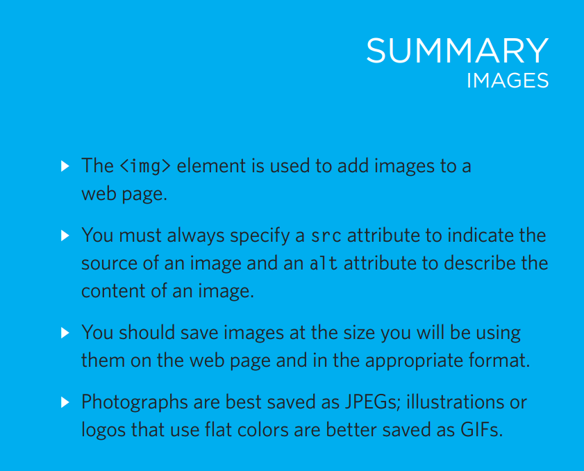
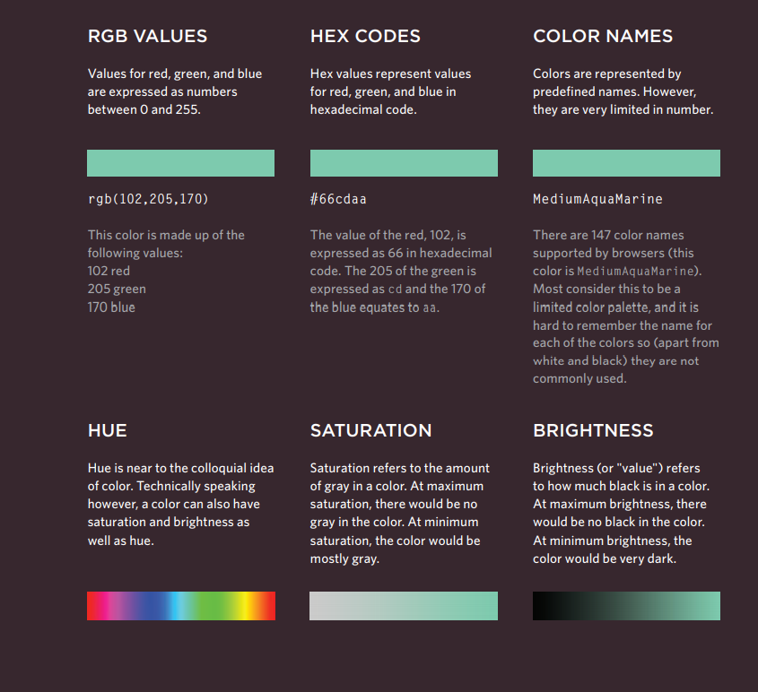

# Storing Images on Your Site
As a website grows, keeping 
images in a separate folder 
helps you understand how the 
site is organized. Here you can 
see an example of the files for 
a website; all of the images are 
stored in a folder called images.
On a big site you might like to 
add subfolders inside the images
folder. For example, images such 
as logos and buttons might sit in 
a folder called interface, product 
photographs might sit in a page 
called products, and images 
related to news might live in a 
folder called news.
If you are using a content 
management system or blogging 
platform, there are usually tools 
built into the admin site that 
allow you to upload images, 
and the program will probably 
already have a separate folder 
for image files and any 
other uploads

# Adding Images
## "img> 
To add an image into the page 
you need to use an img>
element. This is an empty 
element (which means there is 
no closing tag). It must carry the 
following two attributes:
src
This tells the browser where 
it can find the image file. This 
will usually be a relative URL 
pointing to an image on your 
own site. (Here you can see that 
the images are in a child folder 
called images — relative URLs 
were covered on pages 83-84). 
alt
This provides a text description 
of the image which describes the 
image if you cannot see it.
title
You can also use the title
attribute with the img> element 
to provide additional information 
about the image. Most browsers 
will display the content of this 
attribute in a tootip when the 
user hovers over the image.
Adding Images
The text used in the alt attribute 
is often referred to as alt text. 
It should give an accurate 
description of the image content 
so it can be understood by 
screen reader software (used by 
people with visual impairments) 
and search engines.
If the image is just to make a 
page look more attractive (and 
it has no meaning, such as a 
graphic dividing line), then the 
alt attribute should still be used 
but the quotes should be left 
empt

# Height & Width of Images
## height
This specifies the height of the 
image in pixels.
## width
This specifies the width of the 
image in pixels.
Images often take longer to 
load than the HTML code that 
makes up the rest of the page. 
It is, therefore, a good idea to 
specify the size of the image 
so that the browser can render 
the rest of the text on the page 
while leaving the right amount of 
space for the image that is still 
loading

# Where to Place Images in Your Code
Where an image is placed 
in the code will affect how it 
is displayed. Here are three 
examples of image placement 
that produce different results:
## 1: before a paragraph
The paragraph starts on a new 
line after the image.
## 2: inside the start of a 
paragraph
The first row of text aligns with 
the bottom of the image.
## 3: in the middle of a 
paragraph
The image is placed between the 
words of the paragraph that it 
appears in.
## Block elements always appear 
on a new line. Examples of block 
elements include the < and 

 elements.
If the  is followed by a 
block level element (such as a 
paragraph) then the block level 
element will sit on a new line 
after the imageas shown in the 
first example on this page.
## Inline elements sit within a 
block level element and do not 
start on a new line. Examples of 
inline elements include the <b>, 
<em>, and  elements.
If the  element is inside a 
block level element, any text or 
other inline elements will flow 
around the image as shown in 
the second and third examples 
on this page

# summary

# color
## Foreground Color
## rgb values
These express colors in terms 
of how much red, green and 
blue are used to make it up. For 
example: rgb(100,100,90)
## hex codes
These are six-digit codes that 
represent the amount of red, 
green and blue in a color, 
preceded by a pound or hash # 
sign. For example: #ee3e80
## color names
There are 147 predefined color 
names that are recognized 
by browsers. For example: 
DarkCyan

# Background Color
CSS treats each HTML element 
as if it appears in a box, and the 
background-color property 
sets the color of the background 
for that box.
You can specify your choice of 
background color in the same 
three ways you can specify 
foreground colors: RGB values, 
hex codes, and color names 
(covered on the next page).
If you do not specify a 
background color, then the 
background is transparent. 
By default, most browser 
windows have a white 
background, but browser users 
can set a background color for 
their windows, so if you want 
to be sure that the background 
is white you can use the 
background-color property on 
the body> element.

# Understanding Color

# CSS3: HSL & HSLA
## Hue
This is expressed as an angle 
(between 0 and 360 degrees).
## saturation
This is expressed as a 
percentage.
## lightness
This is expressed as a 
percentage with 0% being white, 
50% being normal, and 100% 
being black.
The hsla color property allows 
you to specify color properties 
using hue, saturation, and 
lightness as above, and adds a 
fourth value which represents 
transparency (just like the rgba
property). The a stands for:
## alpha
This is expressed as a 
number between 0 and 1.0. 
For example, 0.5 represents 
50% transparency, and 0.75
represents 75% transparency.

# text
## Specifying Typefaces
### font-family
The font-family property 
allows you to specify the 
typeface that should be used for 
any text inside the element(s) to 
which a CSS rule applies.
The value of this property is the 
name of the typeface you want 
to use. 
The people who are visiting 
your site need the typeface you 
have specified installed on their 
computer in order for it to be 
displayed. 
You can specify a list of fonts 
separated by commas so that, 
if the user does not have your 
first choice of typeface installed, 
the browser can try to use an 
alternative font from the list.
It is also common to end with a 
generic font name for that type

# Size of Type and font-size

The font-size property enables 
you to specify a size for the 
font. There are several ways to 
specify the size of a font. The 
most common are:
## pixels
Pixels are commonly used 
because they allow web 
designers very precise control 
over how much space their text 
takes up. The number of pixels is 
followed by the letters px.
## percentages
The default size of text in 
browsers is 16px. So a size of 
75% would be the equivalent of 
12px, and 200% would be 32px.
If you create a rule to make all 
text inside the body> element 
to be 75% of the default size (to 
make it 12px), and then specify 
another rule that indicates the 
content of an element inside the 
body> element should be 75% 
size, it will be 9px (75% of the 
12px font size)."
## ems
An em is equivalent to the width 
of a letter m. 

# More Font Choice
@font-face allows you to use 
a font, even if it is not installed 
on the computer of the person 
browsing, by allowing you to 
specify a path to a copy of the 
font, which will be downloaded if 
it is not on the user's machine.
Because this technique allows 
a version of the font to be 
downloaded to the user's 
computer, it is important that the 
license for the font permits it to 
be used in this way.
You add the font to your style 
sheet using the @font-face
rule, as shown on the right. 
## font-family
This specifies the name of the 
font. This name can then be used 
as a value of the font-family
property in the rest of the style 
sheet (as shown in the rule for 
the "h1> and h2> elements)"
## src
This specifies the path to the 
font. In order for this technique 
to work in all browsers, you will 
probably need to specify paths 
to a few different versions of the 
font, as shown on the next page.
## format
This specifies the format that the 
font is supplied in. (It's discussed 
in detail on the next page.)
Result
@font-face {
font-family: 'ChunkFiveRegular';
src: url('fonts/chunkfive.eot');}
h1, h2 {
font-family: ChunkFiveRegular, Georgia, serif;}
chapter-12/font-face.html CSS
More Font Choice
@font-face
Many typeface makers do not 
allow you to use their fonts in 
this way, but there are open 
source fonts you can use freely. 
You can find lists of them at:
www.fontsquirrel.com
www.fontex.org
www.openfontlibrary.org
When looking at fonts on these 
sites, it is still important to check 
the font's license agreement 
because some fonts are only free 
for personal use (that is, not for 
use on commercial websites)

# Bold font-weight
The font-weight property 
allows you to create bold text. 
There are two values that this 
property commonly takes:
## normal
This causes text to appear at a 
normal weight.
## bold
This causes text to appear bold.
In this example, you can see 
that the element whose class
attribute has a value of credits
has been bolded

# talic font-style
If you want to create italic text, 
you can use the font-style
property. There are three values 
this property can take:
## normal
This causes text to appear in a 
normal style (as opposed to italic 
or oblique).
## italic
This causes text to appear italic.
oblique
This causes text to appear 
## oblique.
In this example, you can see that 
the credits have been italicized

# UpperCase & LowerCase
## text-transform
### uppercase
This causes the text to appear 
uppercase.
### lowercase
This causes the text to appear 
lowercase.
### capitalize
This causes the first letter of 
each word to appear capitalized.
In this example, the h1>
element is uppercase, the h2>
element is lowercase, and the 
credits are capitalized. In the 
HTML, the word by in the credits 
had a lowercase b

